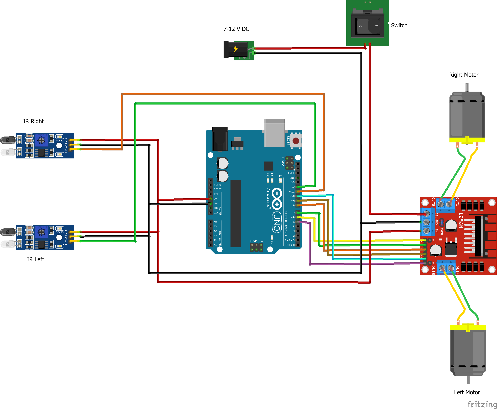

# 🤖 Line Follower Robot using Arduino Uno

A simple **2-Wheel Line Follower Robot** built using **Arduino Uno, L298N Motor Driver, IR Sensors, and DC Motors**. The robot detects a black line using two IR sensors and follows it automatically.

---

## 📌 Project Overview

This project demonstrates an autonomous line-following robot using Arduino. Two IR sensors detect the line, and the Arduino controls the motors through the L298N motor driver to keep the robot on track.

### Features

- Automatic line tracking
- Arduino Uno based
- Dual IR sensors
- L298N motor driver
- Beginner-friendly
- Low-cost design

---

## 📷 Circuit Diagram

> Save your circuit image in the repository as **LineFollwerRobot.png**

```text
README.md
LineFollowerRobot.ino
LineFollwerRobot.png
LICENSE
```

```markdown

```

---

## 🛠 Components

| Component | Quantity |
|-----------|---------:|
| Arduino Uno | 1 |
| L298N Motor Driver | 1 |
| IR Sensors | 2 |
| DC BO Motors | 2 |
| Robot Chassis | 1 |
| Wheels | 2 |
| Castor Wheel | 1 |
| 7–12V Battery | 1 |
| Switch | 1 |

---

## ⚙️ Working

| Left Sensor | Right Sensor | Robot Action |
|-------------|--------------|--------------|
| White | White | Move Forward |
| Black | White | Turn Left |
| White | Black | Turn Right |
| Black | Black | Stop |

---

## 🔌 Connections

### IR Sensors

| Pin | Arduino |
|-----|----------|
| Left OUT | D12 |
| Right OUT | D11 |
| VCC | 5V |
| GND | GND |

### L298N

| Pin | Arduino |
|-----|----------|
| ENA | D10 |
| IN1 | D9 |
| IN2 | D8 |
| IN3 | D7 |
| IN4 | D6 |
| ENB | D5 |

---

## ▶️ How to Run

1. Connect the circuit.
2. Upload the Arduino code.
3. Connect a 7–12V battery.
4. Place the robot on the track.
5. Turn ON the power.
6. Watch the robot follow the line.

---

## 🚀 Applications

- Warehouse robots
- AGVs
- Robotics competitions
- Industrial automation
- Educational projects

---

## 🔮 Future Scope

- PID Control
- Obstacle Avoidance
- Bluetooth Control
- Wi-Fi Monitoring
- Maze Solver

---

## 👥 Team Members

| Name | Role |
|------|------|
| **Lakhan Singh** | Arduino Programming, Integration & Documentation |
| **________________** | Hardware Assembly & Testing |

---

## 🧰 Technologies Used

- Arduino IDE
- Embedded C/C++
- Arduino Uno
- L298N
- IR Sensors

---

## 📄 License

This project is for educational purposes.

---

## ⭐ Support

If you like this project:

- ⭐ Star this repository
- 🍴 Fork this repository

---

## 👨‍💻 Author

**Lakhan Singh**

BCA (Artificial Intelligence & Machine Learning)  
Alliance University, Bengaluru

GitHub: https://github.com/Lakhan07AU
